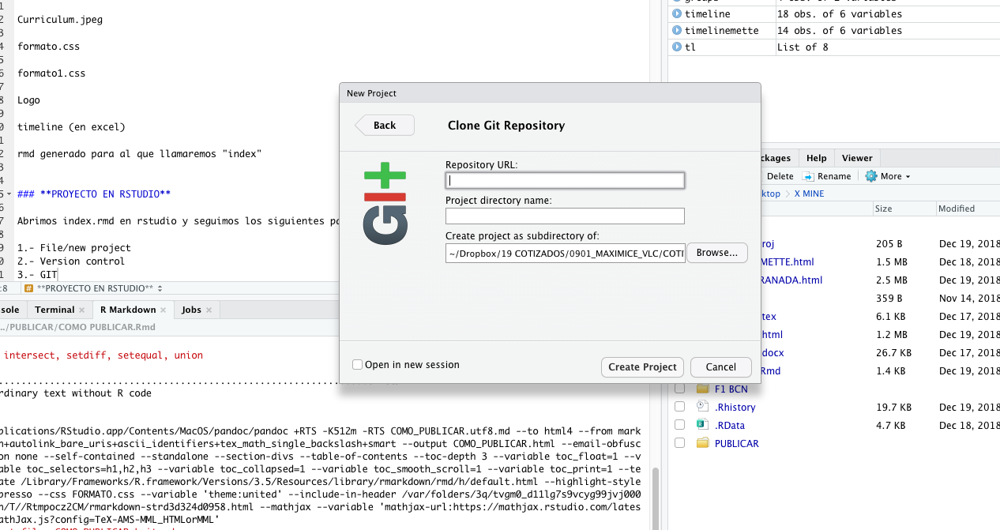
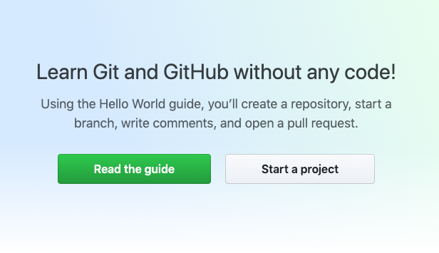
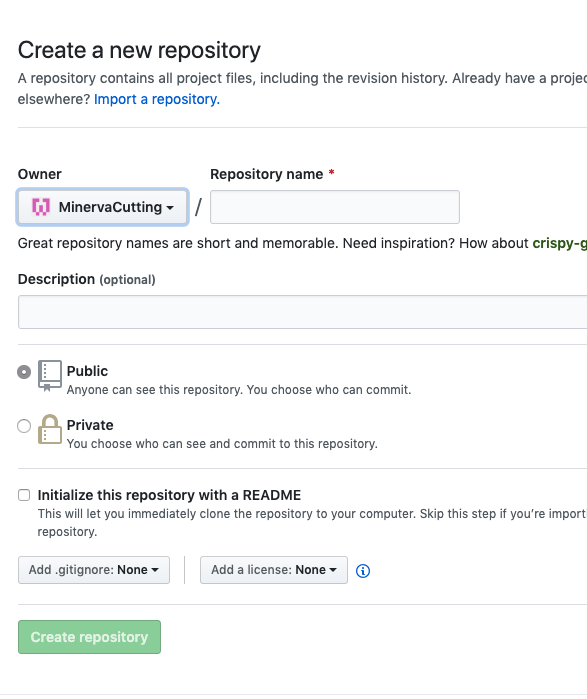
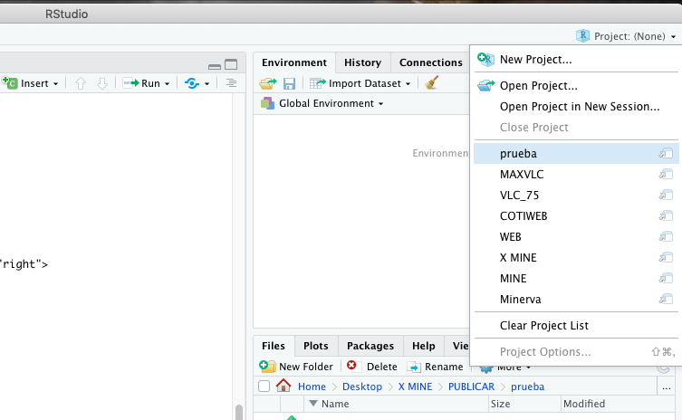
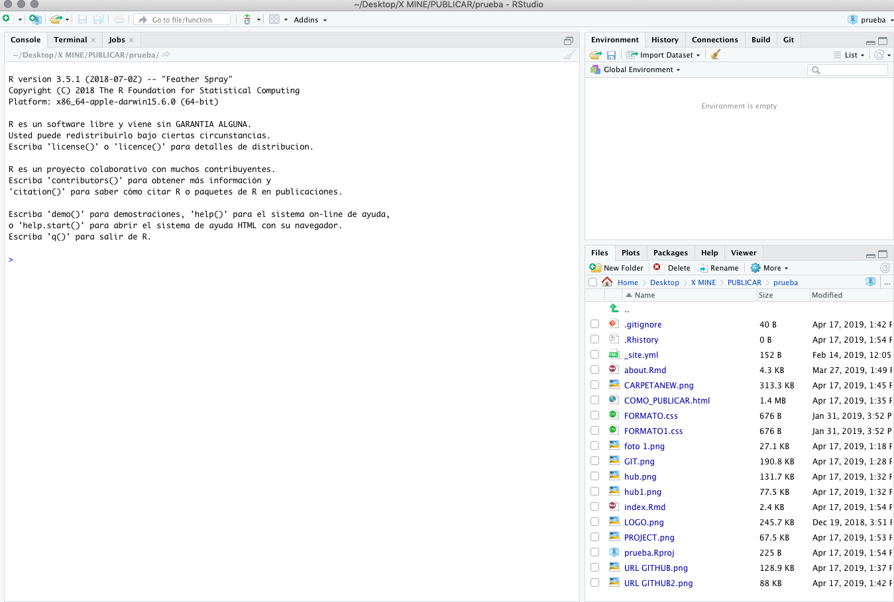
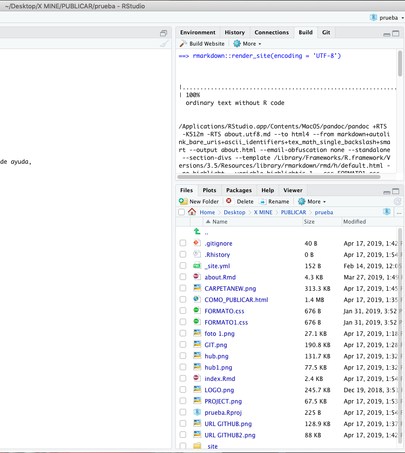

<script> 
    $(document).ready(function() { 
    $head = $('#header'); 
    $head.prepend('<A href = https://www.cuttingedge-events.com></A>') 
    }); 
</script> 


```{r echo=FALSE, message=FALSE,warning=FALSE}
library(readxl)
library(shiny)
library(dplyr)
library(knitr)
```


### 1.-Rmd

El primer paso es crear la carpeta COTI y crear un Rmd como siempre partiendo del Template que hay en X y en la misma carpeta tendréis el logo, el curriculum, el timeline en excel,etc


 

****


### 2.-Carpeta WEBSITE

Una vez acabado el Rmd y comprobado que se renderiza bien en un html, crearemos una carpeta paralela llamada WEBSITE (o similar) y dentro copiaremos de la carpeta COTI y del Template de X los archivos necesarios:

_site.yml

about.Rms

Curriculum.jpeg

formato.css

formato1.css

Logo

timeline (en excel)

rmd generado para al que llamaremos "index"

****


### 3.-PROYECTO EN RSTUDIO

Abrimos index.rmd en rstudio y seguimos los siguientes pasos:

1.- File/new project

2.- Version control

3.- GIT

 

****

Nos pide la URL del repositorio en Github, por lo que lo dejamos en standby y vamos a crearlo (MIRAD EL  PASO 4)

****

Una vez ya tenéis la URL de Github la copiais/pegais para generar el proyecto.

 
****

Al generar el proyecto se crea una carpeta con su nombre 

 

****

Todos los los demás archivos deberán meterse dentro de esta nueva carpeta.


### 4.- REPOSITORIO EN GITHUB

Os metéis en vuestro perfil y clickais en "start a project"

  

****

Escribís el nombre del repositorio y click en "Create repository"

Y aparece una pantalla como esta:

 

****

### 5.- CREAR ARCHIVO _SITE

Cerramos Rstudio y volvemos a abrirlo clickando en index.rmd
En la esquina superior derecha cambiamos Project de (none) a el projecto que hemos creado.

 

Se "reinicia" solo RStudio y aparece la pestaña Built - la clickamos y así generamos el archivo _site necesario para publicar la web.

  

****

### 5.- SUBIR ARCHIVOS AL REPOSITORIO DE GITHUB


