<script> 
    $(document).ready(function() { 
    $head = $('#header'); 
    $head.prepend('<A href = https://www.cuttingedge-events.com></A>') 
    }); 
</script> 


```{r echo=FALSE, message=FALSE,warning=FALSE}
library(readxl)
library(shiny)
library(dplyr)
library(knitr)
```


### 1.-RMD

El primer paso es crear la carpeta COTI y crear un Rmd como siempre partiendo del Template que hay en X y en la misma carpeta tendremos el logo, el curriculum, el timeline en excel,etc


 

****


### 2.-CARPETA WEBSITE

Una vez acabado el Rmd y comprobado que se renderiza bien en un html, crearemos una carpeta paralela llamada WEBSITE (o similar) y dentro copiaremos de la carpeta COTI y del Template de X los archivos necesarios:

_site.yml

about.Rms

Curriculum.jpeg

formato.css

formato1.css

Logo

timeline (en excel)

rmd generado para al que llamaremos "index"

****


### 3.-PROYECTO EN RSTUDIO

Abriremos index.rmd en rstudio y seguiremos los siguientes pasos:

1.- File/new project

2.- Version control

3.- GIT

 

****

Nos pide la URL del repositorio en Github, por lo que lo dejamos en standby y vamos a crearlo (MIRAD EL  PASO 4)

****

Una vez ya tenéis la URL de Github la Copiamos/pegamos para generar el proyecto.

 
****

Al generar el proyecto se crea una carpeta con su nombre 

 

****

Todos los los demás archivos deberán meterse dentro de esta nueva carpeta.


### 4.- REPOSITORIO EN GITHUB

Nos metemos en vuestro perfil y clickamos en "start a project"

 

 

****


Escribimos el nombre del repositorio y click en **Create repository**

Y aparece una pantalla como esta:

 

****

### 5.- CREAR ARCHIVO _SITE

Cerramos Rstudio y volvemos a abrirlo clickando en index.rmd
En la esquina superior derecha cambiamos Project de (none) a el projecto que hemos creado.

 

Se "reinicia" solo RStudio y aparece la pestaña **Build** - clickamos en **Build Website** y así generamos el archivo _site necesario para publicar la web.

 

****

### 6.- SUBIR ARCHIVOS A GITHUB

Clickamos la pestaña GIT y nos aparecen todos los archivos que están dentro de la carpeta con un simbolito amarillo, los clickamos todos y el simbolito se pone azul

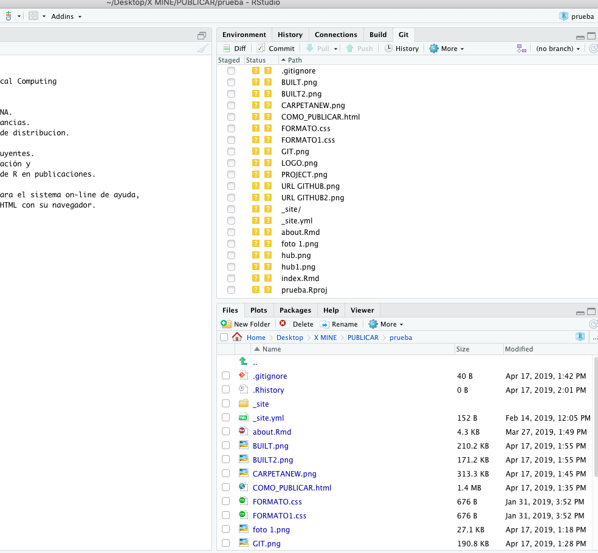

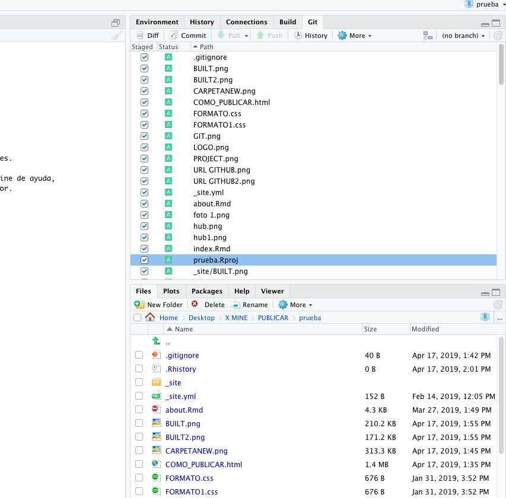 

****

Cuando estén todos en azul, clickamos **commit** y se abre otra pantalla en la que deberemos escibir un mensaje y luego clickar en **commit** otra vez.

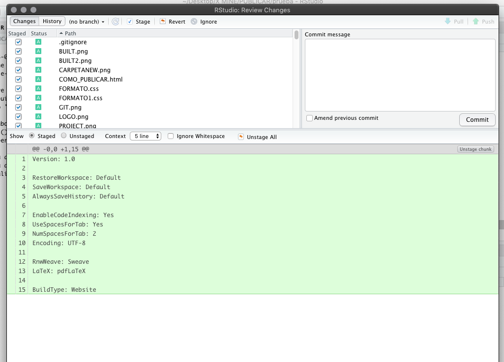 

****

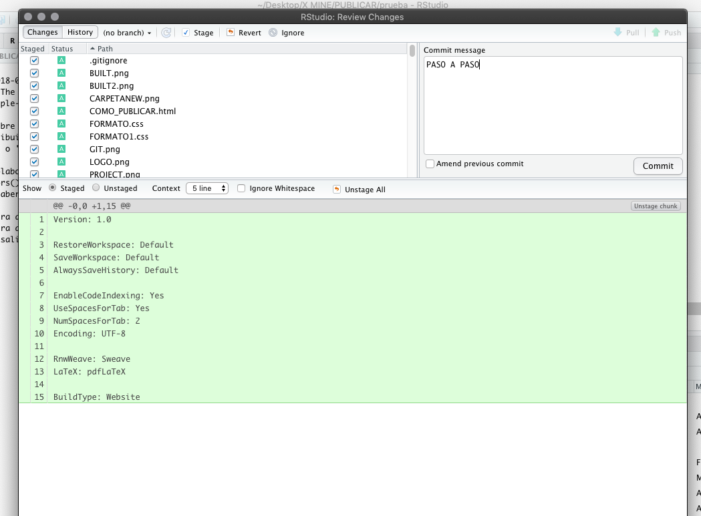 

****

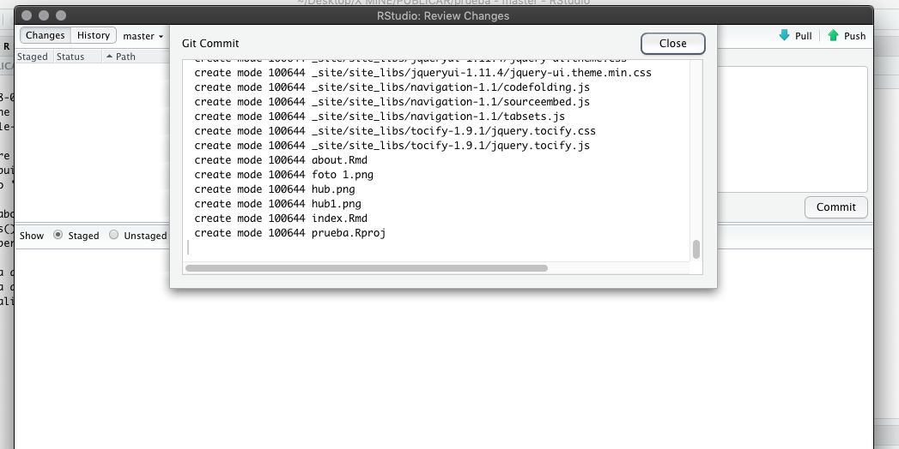 

****
Una vez esté todo ok, cerramos y le damos a la flechita verde **Push** - esto hará que los archivos suban a github y si todo está correcto aparecerá el siguiente mensaje:

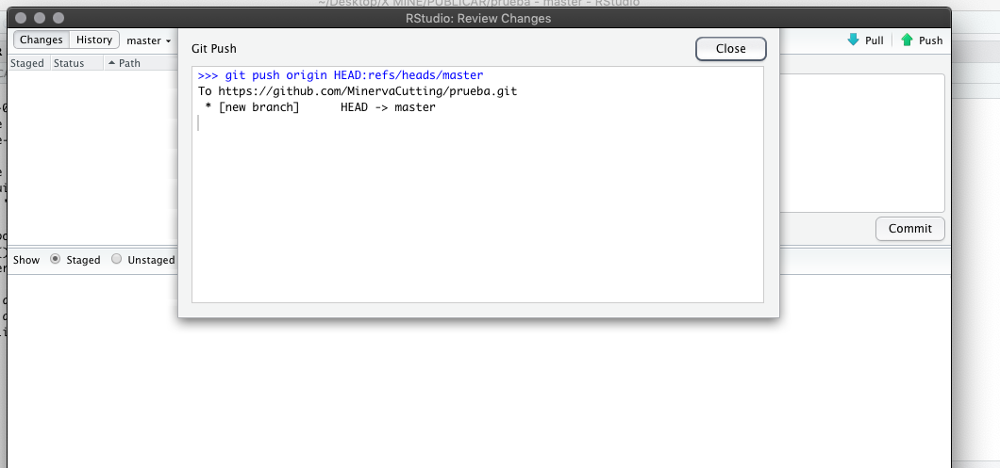 

****

Para finalizar refrescaremos la página de GitHub y aparecerán todos los archivos que hemos subido.

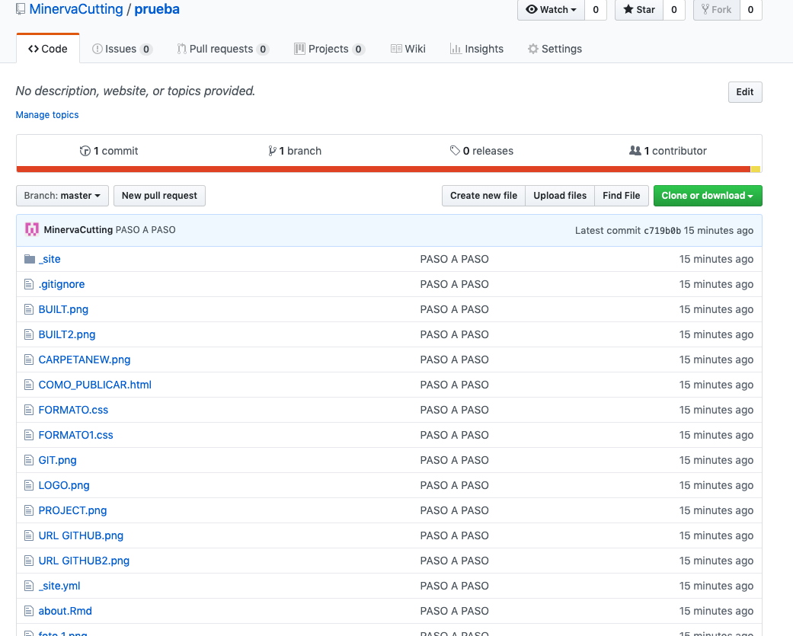 

****

### 7.- PUBLICAR EN NETLIFY

Abrimos nuestra cuenta en app.netlify.com y clickamos en **New site from Git**

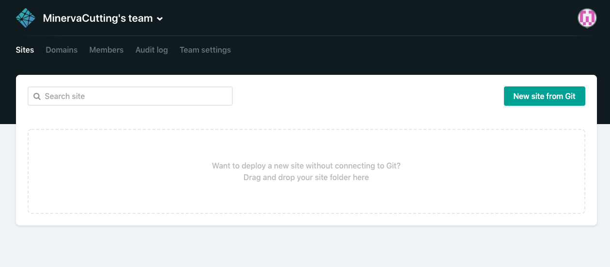 

****

y clickamos en el botón **GitHub** y eso nos lleva a la siguiente pantalla donde aparecen los repositorios de Github.

Clickamos el que nos interesa para nuestra coti y nos lleva a una pantalla así:

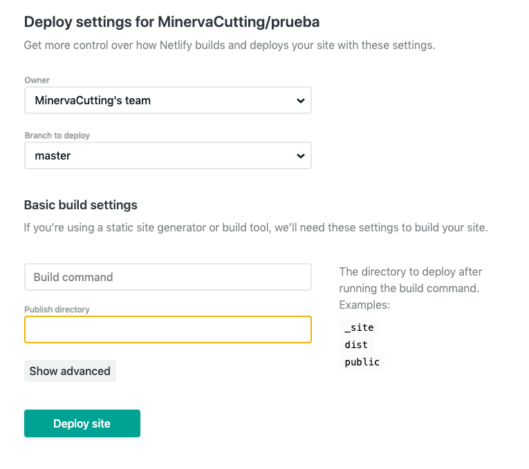 

****

Deberemos escribir _site en **publish directory** y luego **deploy site**

Y después de unos segundos ya nos aparece el link.

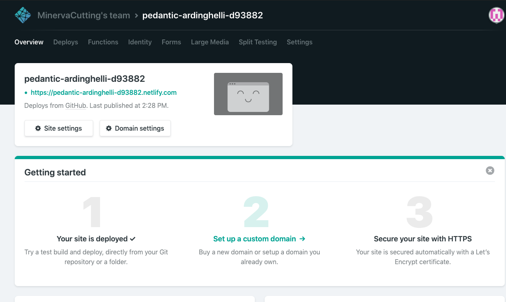 

***

Cambiaremos el nombre del link para que no sea tan ridículo en **site settings** y le pondremos uno que tenga referencia a nuestra coti

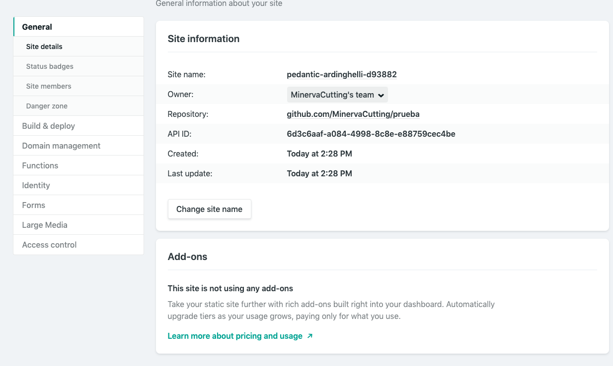 

***

FIN!

